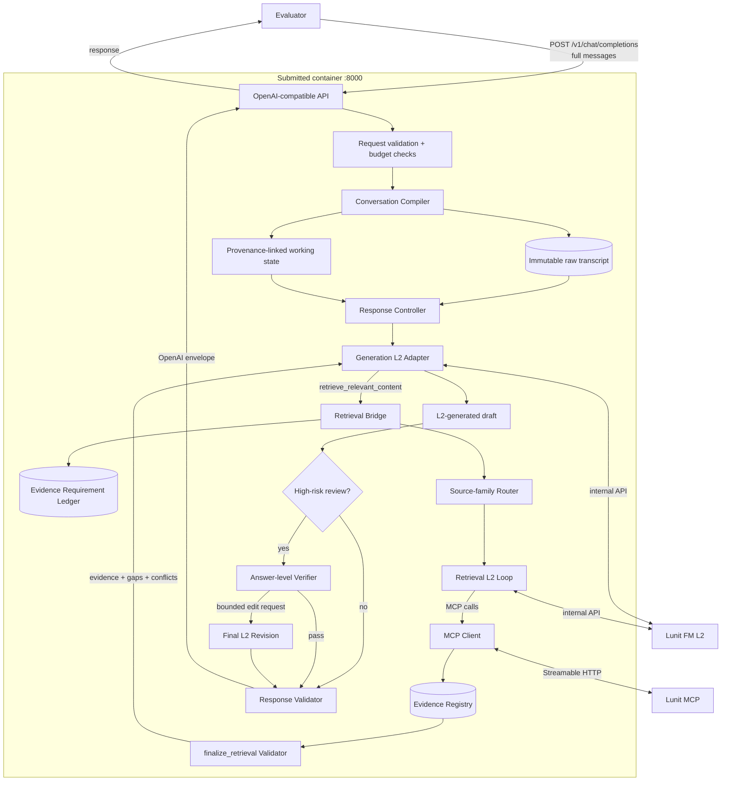
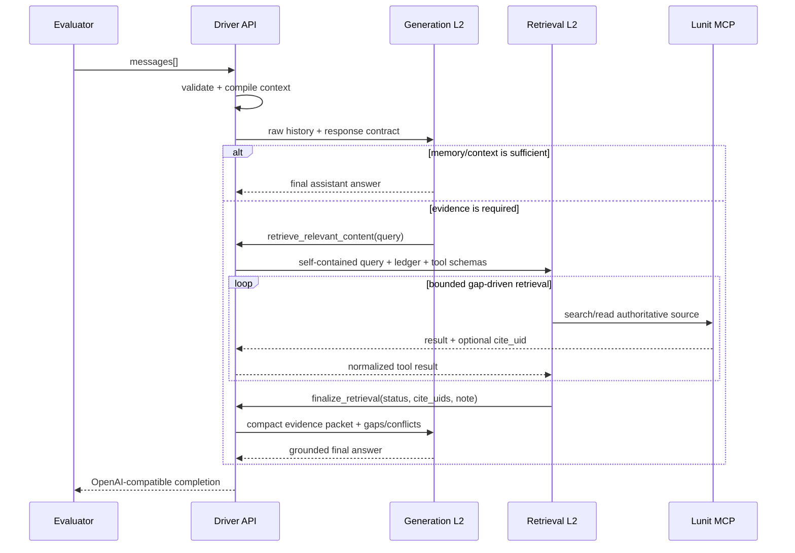

# L2 Clinical Orchestrator

> **Lunit L2가 의료적 판단과 최종 답변을 담당하고, 하네스가 멀티턴 문맥·근거 검색·출처·실패 한계를 통제하는 근거 중심 의료 대화 드라이버**

[](#개발-현황)
[](#제출-및-실행-계약)
[](#lunit-l2-운영-계약)
[](#준수-범위와-비목표)

## 초록

이 프로젝트는 Lunit 의료 특화 파운데이션 모델 **L2**와 주최측 MCP 도구를 결합해 OpenAI-compatible 멀티턴 의료 대화 API를 구현한다. 단순히 L2 앞에 검색기를 붙이는 것이 아니라, 원문 대화를 보존하고 질문별 위험도와 근거 필요성을 판단하며, 명시적인 근거 요구사항이 충족될 때까지만 제한적으로 검색하는 **risk-adaptive orchestration harness**를 설계한다.

Generation 단계의 L2는 대화 전체를 바탕으로 직접 답하거나 `retrieve_relevant_content`를 호출한다. Retrieval 단계의 L2는 MCP 도구로 근거를 수집하고 하네스가 정의한 `finalize_retrieval`로 인용 가능한 항목만 선택한다. 선택된 근거는 출처와 함께 Generation L2에 전달되며, **사용자에게 반환되는 의료 답변은 항상 L2가 생성한다.**

본 문서는 프로젝트의 설계 문서이자 요구사항 명세서다. 아직 확정되지 않은 평가 환경을 사실처럼 가정하지 않으며, 고급 모듈은 일반 의료 품질·지연시간·실패율을 함께 측정한 뒤 채택한다.

## 빠른 시작

runtime dependency가 없는 Python 3.13+ 표준 라이브러리 구현이다. 주최 측은 평가 시 환경변수를 주입하지 않으므로 제출 전용 `.env`를 image에 포함하며, 별도 runtime 환경변수가 있으면 그 값을 우선한다.

```bash
# Offline verification
python3 -m unittest discover -s tests -v

# Local service with organizer credentials
cp .env.example .env
# Edit the submission .env, then load it for direct host execution.
set -a
. ./.env
set +a
python3 -m app.main
```

다른 terminal에서 최소 contract를 확인한다.

```bash
curl http://127.0.0.1:8000/v1/models

curl http://127.0.0.1:8000/v1/chat/completions \
  -H 'Content-Type: application/json' \
  -d '{
    "model": "Lunit/L2-preview",
    "messages": [
      {"role": "user", "content": "고혈압 약 복용 시 주의점을 알려주세요."}
    ]
  }'
```

제출 image와 같은 방식으로 실행하려면 다음을 사용한다.

```bash
docker build -t lunit-hackathon-driver:local .
docker run --rm -p 8000:8000 lunit-hackathon-driver:local
BASE_URL=http://127.0.0.1:8000 scripts/smoke_test.sh
```

Docker build는 repository root의 `.env`를 `/app/submission.env`로 포함한다. 애플리케이션은 `LUNIT_FM_API_KEY` runtime 환경변수를 먼저 사용하고, 없을 때만 bundled key를 읽는다.

## 목차

- [문제 정의](#문제-정의)
- [빠른 시작](#빠른-시작)
- [설계 상태 표기](#설계-상태-표기)
- [준수 범위와 비목표](#준수-범위와-비목표)
- [요구사항 명세](#요구사항-명세)
- [시스템 아키텍처](#시스템-아키텍처)
- [핵심 컴포넌트](#핵심-컴포넌트)
- [RAG 및 MCP 전략](#rag-및-mcp-전략)
- [멀티턴 문맥 전략](#멀티턴-문맥-전략)
- [응답 품질 계약](#응답-품질-계약)
- [신뢰성 및 실패 처리](#신뢰성-및-실패-처리)
- [제출 및 실행 계약](#제출-및-실행-계약)
- [평가 및 검증 계획](#평가-및-검증-계획)
- [개발 로드맵](#개발-로드맵)
- [현재 프로젝트 구조](#현재-프로젝트-구조)
- [공개 연구에서 얻은 설계 근거](#공개-연구에서-얻은-설계-근거)
- [미확정 사항과 위험](#미확정-사항과-위험)
- [최종 제출 체크리스트](#최종-제출-체크리스트)

---

## 문제 정의

### 핵심 목표

**멀티턴 대화의 임상적으로 중요한 사실을 잃지 않으면서, 필요한 경우에만 권위 있는 근거를 검색하고, L2가 정확·완전·맥락 친화적인 최종 답변을 생성하도록 만드는 것**이 핵심 목표다.

이 문제는 일반적인 chatbot wrapper보다 어렵다.

1. L2는 의료 특화 모델이지만 범용 멀티턴 chat model처럼 다루면 예상과 다르게 동작할 수 있다.
2. L2의 권장 사용법은 retrieval과 generation을 분리한 두 단계 호출이다.
3. 평가기는 여러 대화 turn을 전달하며, 이전 약물·용량·알레르기·부정 표현·사용자 수정사항을 답변에 반영해야 한다.
4. 평가 환경은 공용 인터넷에 접근할 수 없는 격리 환경이다.
5. 숨은 평가 데이터를 재구성할 수 없으므로 특정 문제 암기가 아닌 일반 의료 대화 역량으로 성능을 내야 한다.

### 설계 가설

> 더 많은 agent나 더 많은 검색이 곧 더 좋은 답을 뜻하지 않는다. **원문 문맥 보존, 명시적인 근거 공백, 출처에 맞는 얕고 제한된 검색, 답변 수준의 검증**이 중요하다.

따라서 본 프로젝트는 무제한 agent loop가 아니라 `DIRECT`, `CLARIFY`, `GROUNDED`, `HIGH_RISK`로 점진적으로 확장되는 상태 기계를 채택한다.

## 설계 상태 표기

| 표기 | 의미 |
| --- | --- |
| **REQUIRED** | 주최측 자료에서 확인된 제출·운영 규칙. 구현이 반드시 만족해야 한다. |
| **DECIDED** | 현재 팀의 기본 설계 결정. 변경 시 근거와 회귀 검증이 필요하다. |
| **PROPOSED** | 실험으로 효과와 비용을 검증한 뒤 활성화할 후보 설계다. |
| **OPEN** | 주최측 확인 또는 실제 endpoint 검증이 필요한 미확정 사항이다. |

## 준수 범위와 비목표

### 준수 원칙

- **REQUIRED** 최종 사용자용 의료 답변은 Lunit L2가 생성한다.
- **REQUIRED** 평가 중 공용 인터넷, 외부 SaaS, 외부 database에 의존하지 않는다.
- **REQUIRED** HealthBench 문제·정답·개별 rubric·grader prompt·holdout set을 복원하거나 암기하지 않는다.
- **DECIDED** 공개 HealthBench 자료는 평가 interface와 일반 의료 응답 품질을 이해하는 용도로만 사용한다.
- **DECIDED** dashboard 피드백은 개별 문항 추론이 아닌 전체 역량과 신뢰성의 집계 지표로만 사용한다.
- **DECIDED** API key, 환자 원문 대화, 전체 검색 문서를 source/image/log에 남기지 않는다.

### 비목표

- 사용자 UI 또는 web frontend: 제출물은 UI가 아니라 Dockerized API service다.
- L2 가중치 재학습: 현재 범위는 주최측 endpoint를 사용하는 inference harness이며 재학습 가능 여부는 확인되지 않았다.
- Patient Simulator의 평가 runtime 포함: simulator는 개발용 대화 생성기에만 사용한다.
- 모든 질문에 강제 RAG를 적용하는 것.
- 검색 유사도나 `relevance_score`를 답변 신뢰도 확률로 노출하는 기능.
- 특정 진료과·문항 유형·답변 길이를 HealthBench 사례에 맞춰 고정하는 benchmark-specific 분기.

---

## 요구사항 명세

### 1. 대회 및 제출 요구사항

| ID | 상태 | 요구사항 | 검증 기준 |
| --- | --- | --- | --- |
| SUB-001 | REQUIRED | 저장소 root에 `Dockerfile`이 존재해야 한다. | clean checkout에서 파일 존재 확인 |
| SUB-002 | REQUIRED | 평가 VM에서 image build가 5분 이내 완료되어야 한다. | cache 없는 제한 환경 build 시간 측정 |
| SUB-003 | REQUIRED | 별도 수동 초기화 없이 container가 시작되어야 한다. | `docker run` 한 번으로 service ready |
| SUB-004 | REQUIRED | service는 `0.0.0.0:8000`에 bind하고 `EXPOSE 8000`을 선언해야 한다. | container 내부/외부 port probe |
| SUB-005 | REQUIRED | 제출 branch는 정확히 `lunit/hackathon-submission`이어야 한다. | branch명과 원격 HEAD 확인 |
| SUB-006 | REQUIRED | branch HEAD의 40자리 전체 commit SHA와 사용 model명을 제출한다. | `git rev-parse HEAD`와 runtime config 대조 |
| SUB-007 | REQUIRED | dashboard의 마지막 제출이 최종 제출로 간주된다. | 제출 직전 SHA/model/trial 기록 대조 |
| SUB-008 | REQUIRED | 하나의 제출물이 Benchmark와 Frontier 부문에 공통 사용된다. | 별도 부문별 artifact/분기 없음 |

### 2. API 요구사항

| ID | 상태 | 요구사항 | 검증 기준 |
| --- | --- | --- | --- |
| API-001 | REQUIRED | `GET /v1/models`를 제공한다. | OpenAI-compatible model list response |
| API-002 | REQUIRED | `POST /v1/chat/completions`를 제공한다. | 정상 request에 `choices[0].message.content` 반환 |
| API-003 | REQUIRED | evaluator가 전달한 conversation context를 사용한다. | 이전 turn 사실·수정·지시 contract test 통과 |
| API-004 | DECIDED | request의 `messages` 전체를 authoritative state로 취급한다. | server-side session 없이 동작 |
| API-005 | DECIDED | transport layer는 stateless로 구현한다. | 이전 request cache 없이 정확히 동작 |
| API-006 | DECIDED | 알 수 없는 field에는 호환 가능한 관용성을 두되 필수 field는 검증한다. | malformed/extra-field test와 명시적 4xx |
| API-007 | OPEN | streaming, evaluator 인증, optional field 범위는 추가 확인한다. | organizer 자료 또는 live probe로 확정 |

### 3. Lunit L2 운영 요구사항

| ID | 상태 | 요구사항 | 검증 기준 |
| --- | --- | --- | --- |
| L2-001 | REQUIRED | 내부 model identifier는 `Lunit/L2-preview`를 사용한다. | 환경설정 및 제출 model명 대조 |
| L2-002 | REQUIRED | 최종 assistant 의료 content는 L2가 생성한다. | retrieval text/hard-coded 의료 답변 반환 금지 |
| L2-003 | DECIDED | retrieval과 generation에 서로 다른 system prompt와 tool set을 사용한다. | call trace에서 분리 확인 |
| L2-004 | DECIDED | Generation L2에는 `retrieve_relevant_content`만 노출한다. | raw MCP/finalizer가 generation schema에 없음 |
| L2-005 | DECIDED | Retrieval L2에는 선택된 MCP tools와 `finalize_retrieval`을 노출한다. | retrieval tool/terminal contract test |
| L2-006 | DECIDED | empty output, malformed tool call, fenced structured output을 제한적으로 복구한다. | fault-injection 후 bounded recovery |
| L2-007 | OBSERVED | 표준 non-streaming `tools`/`tool_choice` 요청, `message.tool_calls`, `role: tool` continuation을 지원한다. | live forced-tool probe와 실제 adapter continuation 성공 |
| L2-008 | OPEN | context limit, rate/concurrency limit, retry header, streaming behavior를 확인한다. | 연결 환경 behavior 기록 |

### 4. 멀티턴 및 임상 문맥 요구사항

| ID | 상태 | 요구사항 | 검증 기준 |
| --- | --- | --- | --- |
| CTX-001 | DECIDED | 원본 role-labelled transcript를 손실 없이 보존한다. | normalize 전후 role/content 비교 |
| CTX-002 | DECIDED | 약물, 용량, 알레르기, 임신, 나이, 시간, 부정, 사용자 수정을 임의로 변경하지 않는다. | targeted multi-turn regression |
| CTX-003 | DECIDED | “그 약”, “아까 수치” 같은 참조를 해소해 self-contained retrieval query로 만든다. | coreference synthetic test |
| CTX-004 | PROPOSED | 긴 대화에는 turn provenance가 연결된 request-local working state를 추가한다. | raw-only 대비 품질·latency ablation |
| CTX-005 | DECIDED | derived state가 원문과 충돌하면 원문을 우선하고 충돌 자체를 보존한다. | contradiction injection test |
| CTX-006 | DECIDED | context compiler 실패 시 raw transcript로 fallback한다. | invalid schema fault test |

### 5. 검색 및 근거 요구사항

| ID | 상태 | 요구사항 | 검증 기준 |
| --- | --- | --- | --- |
| RAG-001 | DECIDED | retrieval query는 한 요청만으로 의미가 완결되어야 한다. | 대명사·누락 대상 없는 query assertion |
| RAG-002 | DECIDED | 목적과 관할에 맞는 가장 좁고 권위 있는 source family를 우선한다. | routing suite 통과 |
| RAG-003 | DECIDED | 검색은 명시적 evidence gap에만 계속하며 횟수·시간·크기를 제한한다. | budget/early-stop test |
| RAG-004 | DECIDED | citable result를 request-local Registry에 `cite_uid`로 등록한다. | unknown/duplicate ID test |
| RAG-005 | DECIDED | finalizer status는 `sufficient`, `partial`, `no_evidence`만 허용한다. | schema validation |
| RAG-006 | DECIDED | critical requirement가 남으면 model이 요청해도 `sufficient`를 수락하지 않는다. | false-sufficient adversarial test |
| RAG-007 | DECIDED | `partial`/`no_evidence`를 완전한 근거처럼 generation에 전달하지 않는다. | uncertainty propagation test |
| RAG-008 | DECIDED | FAERS 관찰 신호를 인과관계로 표현하지 않는다. | source-semantic test |
| RAG-009 | PROPOSED | all-tools와 family routing + fallback을 비교한다. | validity·recall·latency·quality ablation |

### 6. 응답 품질 및 안전 요구사항

| ID | 상태 | 요구사항 | 검증 기준 |
| --- | --- | --- | --- |
| RES-001 | DECIDED | 질문에 직접 답한 뒤 필요한 근거·행동·다음 단계를 제시한다. | response-contract evaluator |
| RES-002 | DECIDED | 사실, 추론, 불확실성을 구분한다. | unsupported certainty test |
| RES-003 | DECIDED | 중요한 금기·상호작용·red flag를 다루되 blanket emergency 문구는 피한다. | 위험/비위험 paired tests |
| RES-004 | DECIDED | 사용자 역할·전문성·언어·관할·자원·형식에 맞춘다. | audience/format suite |
| RES-005 | DECIDED | citation은 실제 evidence가 해당 claim을 지지할 때만 사용한다. | citation entailment test |
| RES-006 | PROPOSED | 고위험 응답만 dual-track review와 제한적 L2 revision을 수행한다. | 품질·latency·failure ablation |
| RES-007 | DECIDED | reviewer는 context/evidence에 없는 의료 사실을 도입하지 않는다. | revision coverage test |

### 7. 비기능 요구사항

| ID | 상태 | 요구사항 | 검증 기준 |
| --- | --- | --- | --- |
| NFR-001 | REQUIRED | 공용 인터넷이 차단된 평가 환경에서 실행된다. | 외부 egress 차단 test |
| NFR-002 | DECIDED | 시작 시 package/model/data download를 수행하지 않는다. | cold-start network trace |
| NFR-003 | DECIDED | 모든 L2/MCP loop에 call budget, retry budget, per-call timeout을 둔다. 전체 wall-clock request deadline은 기본 비활성이고, 필요하면 opt-in으로만 켠다. | infinite-loop fault injection |
| NFR-004 | DECIDED | secret과 raw clinical content를 운영 log에 기록하지 않는다. | log scan |
| NFR-005 | DECIDED | upstream failure 시 의료 내용을 꾸며내지 않고 error 또는 L2가 표현한 제한된 불확실성으로 종료한다. | timeout/5xx/partial tests |
| NFR-006 | DECIDED | dependency와 image 크기를 최소화해 5분 build 제한을 지킨다. | clean build benchmark |
| NFR-007 | OPEN | evaluator deadline, concurrency, CPU/RAM 확인 후 budget 기본값을 확정한다. | organizer 확인/trial telemetry |

---

## 시스템 아키텍처

### 전체 구조



`Lunit FM L2`와 `Lunit MCP`는 주최측 service다. 평가 환경에서 이 두 내부 service로 접근하는 방식과 credential 주입은 **OPEN**이며 공용 인터넷 접근을 의미하지 않는다.

### 요청 처리 순서



### 점진적 실행 lane

| Lane | 사용 조건 | 예상 경로 |
| --- | --- | --- |
| `DIRECT` | 현재 대화만으로 충분한 설명·요약·공감·일반적 해석 | Generation L2 1회 |
| `CLARIFY` | 누락 사실이 안전성이나 권고를 실질적으로 바꿈 | 가장 작은 확인 질문 + 지금 가능한 도움 |
| `GROUNDED` | guideline, 약물 안전성, 허가, 급여, 코드, 법처럼 source-sensitive한 사실 | Generation → Retrieval/MCP → Generation |
| `HIGH_RISK` | 용량, 상호작용, 금기, 응급 triage, 임신/소아, 근거 충돌·부족 | Grounded path + answer-level 검증 + 필요 시 L2 revision |

Lane은 답변 거부 등급이 아니라 계산과 검증의 깊이다. 교육·번역·오정보 교정·개별 처방 요청을 구분해 과도한 안전 문구나 over-refusal을 피한다.

---

## 핵심 컴포넌트

### 1. OpenAI-compatible API Adapter

- request/response schema, timeout, cancellation, request ID를 관리한다.
- `messages`를 request-local authoritative history로 사용한다.
- orchestration 내부 구조와 retrieval trace를 외부 API에 노출하지 않는다.
- validation/upstream error를 안정적인 JSON envelope로 반환한다.

### 2. Conversation Compiler

원문 transcript는 절대 대체하지 않는다. 필요할 때만 다음 working state를 파생한다.

```text
ConversationState
  current_intent, requested_format
  user_profile: role, expertise, language, jurisdiction, constraints
  patient_facts: demographics, pregnancy, symptoms, diagnoses
  medications: name, dose, route, adherence
  allergies, vitals, tests
  prior_claims, user_corrections
  unresolved_references, contradictions, missing_critical_facts
  provenance: field -> source turn(s)
```

L2의 single-turn 최적화 제약을 보완하기 위해 (1) native `messages` 전체 전달과 (2) role-labelled case packet + 최신 user turn 표현을 비교한다. 기본값은 원문 전체 보존이며, 압축은 실제 context limit에 닿거나 실험상 이점이 있을 때만 사용한다.

### 3. Response Controller

요청마다 답변 가능성, clarification 필요성, 위험도, 사용자 깊이, 관할, 근거가 필요한 atomic claim, source family, 실행 budget을 정한다. 초기 버전은 Generation L2의 native retrieval 선택을 우선한다. 별도 controller L2는 품질 개선이 추가 latency와 실패 표면보다 클 때만 도입한다.

### 4. Evidence Requirement Ledger

검색의 목적을 “관련 문서 많이 찾기”가 아니라 “답변에 필요한 claim을 지지하기”로 바꾼다.

```text
EvidenceRequirement
  id
  claim_or_question
  source_preference
  jurisdiction_and_population_constraints
  criticality: critical | important | supporting
  status: missing | supported | contradicted | unresolved
  cite_uids[]
  gap_reason
```

Retrieval L2는 ledger update를 제안할 수 있지만 harness가 identifier와 상태 전이를 검증한다. 검색 진행상태를 자유 형식 model memory에만 맡기지 않는다.

### 5. Retrieval Bridge와 `finalize_retrieval`

Generation 단계에는 conceptual tool 하나만 제공한다.

```python
def retrieve_relevant_content(query: str):
    """Run bounded retrieval for one self-contained evidence question."""
```

Retrieval terminal tool은 주최측 예시의 핵심 contract를 유지한다.

```python
class CitableItem:
    cite_uid: str
    relevance_score: float

class CitationSelection:
    status: Literal["sufficient", "partial", "no_evidence"]
    items: list[CitableItem]
    note: str = ""
```

`finalize_retrieval`은 MCP tool이 아니라 harness-defined terminal tool이다. 첫 유효 terminal call을 받으면 retrieval을 중지한다. model이 종료하지 못하면 budget 종료 시 citable evidence 유무에 따라 `partial` 또는 `no_evidence`로 결정론적으로 마감한다.

### 6. Evidence Registry와 Provenance Bridge

모든 citable result는 request-local registry에 저장한다.

```text
EvidenceItem
  cite_uid
  source_family, jurisdiction, title, url, version_or_date
  supporting_excerpt
  tool_call_id, retrieval_requirement_ids[]
  relation: supports | contradicts | contextual
  selected: bool
```

Generation에는 선택 근거의 compact packet, 해결되지 않은 gap, 충돌만 전달한다. 등록되지 않은 `cite_uid`, 원문과 불일치하는 citation, source type을 바꾼 표현은 거부한다.

### 7. Sufficiency Validator

`relevance_score`가 높다는 이유만으로 충분하다고 판단하지 않는다.

```text
sufficient :=
  every critical requirement is supported
  AND every selected cite_uid exists in the registry
  AND no decision-changing conflict is hidden
  AND population / jurisdiction / date constraints are compatible
```

- 조건을 모두 만족하면 `sufficient`
- 일부 답변 가능한 근거가 있으나 중요한 gap이 남으면 `partial`
- 사용할 수 있는 citable evidence가 없으면 `no_evidence`

### 8. Conditional Answer Verifier

고위험 lane에서만 draft가 response contract를 충족하는지 확인한다. deterministic check로 해결되지 않는 문제만 reviewer에 전달하고, 문제가 발견된 경우에만 마지막 L2 revision을 수행한다. reviewer는 새로운 의료 지식을 창작하지 않고 누락·충돌·부정확한 citation에 대한 제한된 수정 지시만 낸다.

---

## RAG 및 MCP 전략

### Source-aware routing

| 정보 요구 | 우선 source/tool family | 주의점 |
| --- | --- | --- |
| 임상 guideline 권고 | `index_list_documents` → `index_get_relevant_nodes` → 필요한 `index_get_page_content` | 필요한 범위만 읽고 page call당 최대 20 page |
| 공식 약물 label·warning·interaction | `adr_retrieve_drug_info` / DailyMed | 미국 label의 관할을 명시 |
| 한국 허가·적응증·용법·금기 | `openapi_mfds_*` | MFDS 허가와 임상 권고를 구분 |
| 한국 급여·약가·oncology notice | `hira_updates_search`, `openapi_hira_*`, HIRA index | 허가와 급여를 별개로 표현 |
| KCD 코드 검색·확인 | `kcd_search_codes` → `kcd_get_name`; 필요 시 HIRA validation | KCD version을 보존 |
| 한국 법령 | `openapi_law_search` → `openapi_law_list_articles` → `openapi_law_get_article` | 조문과 시행일 확인 |
| 연구 근거·HIRA FAQ | schema 확인 후 `rag_vector_query` | abstract를 임상 consensus로 과장하지 않음 |
| 이상반응 signal | schema 확인 후 bounded `rag_sql_query` on FAERS | association이지 causation이 아님 |

### 검색 원칙

1. 대명사와 생략된 조건을 대화 문맥으로 해소한다.
2. guideline/허가/급여/법/코드/연구/관찰 신호를 다른 claim type으로 구분한다.
3. 목적에 맞는 공식 도구를 generic vector/SQL보다 우선한다.
4. unfamiliar dataset은 `rag_get_all_data_sources`와 `rag_get_data_source_detail`로 schema를 먼저 확인한다.
5. 검색 후 requirement를 `supported`, `contradicted`, `missing`으로 갱신한다.
6. 다음 검색은 이름이 붙은 gap에 대해서만 수행한다.
7. 더 깊은 검색이 noise와 timeout을 늘릴 수 있으므로 얕은 early stop을 기본 가설로 검증한다.

---

## 멀티턴 문맥 전략

평가기는 conversation turn과 context를 service에 전달한다. driver는 별도 UI나 server session 없이 매 request의 전체 `messages`를 사용한다.

안전성 보존 대상은 사용자 역할과 목표, 나이·임신·지역·자원, 증상 시간과 변화, 진단, 약물·용량·경로·복약 여부, 알레르기, 검사값·단위·시점, 부정 표현, 사용자 수정, 아직 답하지 못한 요구와 참조 대상이다.

요약이 필요해도 최신 turn과 원문 transcript를 함께 유지하고, derived state의 모든 임상 field는 source turn을 가리킨다. 숨은 장기 memory를 정확성의 전제 조건으로 사용하지 않는다.

---

## 응답 품질 계약

HealthBench의 숨은 rubric을 흉내 내지 않고 모든 의료 대화에 일반화되는 두 track을 사용한다.

### Clinical / Evidence Track

- 질문에 필요한 핵심 사실과 직접 답변
- 선택지나 다음 행동을 바꾸는 조건
- 관련 금기, 상호작용, red flag
- 근거가 지지하는 범위와 해결되지 않은 불확실성
- 실질적인 다음 단계와 시점
- citation과 claim의 일치

### Interaction / Context Track

- 사용자가 실제로 요청한 것과 요청 형식
- 환자·보호자·clinician 등 사용자 역할
- 의료 이해도에 맞춘 용어와 설명 깊이
- 언어, 지역, 비용·접근성·자원 제약
- 불필요한 반복과 generic disclaimer 제거
- 앞선 대화와의 일관성 및 사용자 수정 반영

좋은 답변은 단순히 길거나 citation이 많은 답변이 아니다. **직접적이되 의사결정에 필요한 내용을 빠뜨리지 않고, 위험에 비례해 안전하며, 근거의 한계를 숨기지 않는 답변**을 목표로 한다.

---

## 신뢰성 및 실패 처리

| 실패 | 처리 원칙 |
| --- | --- |
| 잘못된 HTTP request | 명확한 4xx OpenAI-compatible error; model은 호출하지 않음 |
| Generation L2 empty content | 동일 request의 제한적 retry; 계속 실패하면 5xx, hard-coded 의료 답변 금지 |
| malformed/unknown tool call | 한 번의 schema feedback 또는 repair 후 종료; 무한 retry 금지 |
| Retrieval L2가 finalize하지 않음 | total budget 종료 후 evidence 유무에 따라 `partial`/`no_evidence` |
| MCP timeout/5xx | transient error만 bounded backoff; 남은 evidence로 degraded result |
| 존재하지 않는 `cite_uid` | 선택에서 제거하고 sufficiency 재평가 |
| contradictory evidence | 숨기지 않고 conflict packet으로 generation에 전달 |
| derived context schema 실패 | raw transcript path로 fallback |
| 전체 deadline 임박 | 새 tool/review를 시작하지 않고 가장 안전한 유효 단계에서 종료 |
| organizer L2/MCP 접근 불가 | 정상 assistant 응답을 위조하지 않고 service error 반환 |

운영 metric은 content 없이 기록한다: request ID, history hash, lane, 단계별 latency, L2/MCP call 수, retry/timeout, retrieval status, citation validation, completion/error state. API key, raw message, 전체 검색문서는 기록하지 않는다.

---

## 제출 및 실행 계약

### 제출물이 무엇인가

제출 대상은 **UI가 아니라 Git repository의 특정 commit에서 build되는 Docker image**다.

```text
Repository branch + 40-char HEAD SHA + model name
  -> evaluator builds root Dockerfile
  -> evaluator starts container on port 8000
  -> evaluator calls OpenAI-compatible endpoints
  -> driver calls L2/MCP as allowed by organizer environment
  -> driver returns the next assistant message
```

### 최소 API 예시

`GET /v1/models`

```json
{
  "object": "list",
  "data": [
    {
      "id": "Lunit/L2-preview",
      "object": "model",
      "owned_by": "lunit"
    }
  ]
}
```

`POST /v1/chat/completions`

```json
{
  "model": "Lunit/L2-preview",
  "messages": [
    {"role": "user", "content": "첫 번째 질문"},
    {"role": "assistant", "content": "이전 답변"},
    {"role": "user", "content": "그 약은 임신 중에도 괜찮나요?"}
  ]
}
```

최소 성공 response는 `choices[0].message.role == "assistant"`와 non-empty `choices[0].message.content`를 제공한다. exact optional field와 streaming 지원 여부는 live contract 확인 뒤 확정한다.

### Lunit L2 운영 계약

| 설정 | 값/정책 |
| --- | --- |
| L2 base URL | `https://model.hackathon.lunit.io` |
| L2 model | `Lunit/L2-preview` |
| MCP URL | `https://mcp.hackathon.lunit.io/mcp` |
| 인증 | `Authorization: Bearer <team key>` |
| 공통 secret env | `LUNIT_FM_API_KEY` |

권장 runtime 환경변수:

| 변수 | 필수 | 기본/예시 | 설명 |
| --- | --- | --- | --- |
| `LUNIT_FM_API_KEY` | 예 | bundled `.env` | runtime 값 우선, 없으면 제출 image의 key 사용 |
| `LUNIT_FM_API_URL` | 예 | `https://model.hackathon.lunit.io` | L2 endpoint |
| `LUNIT_FM_MODEL` | 예 | `Lunit/L2-preview` | 내부 L2 및 제출 model명 |
| `LUNIT_MCP_URL` | 제안 | `https://mcp.hackathon.lunit.io/mcp` | MCP endpoint |
| `REQUEST_TIMEOUT_SEC` | 제안 | 비활성 | 전체 wall-clock request timeout. `0`, 빈 값, 또는 미설정이면 비활성 |
| `RETRIEVAL_TIMEOUT_SEC` | 제안 | `30` | 선택적 retrieval stage 전체 budget. 초과 시 generation으로 fail-soft 복귀 |
| `L2_TIMEOUT_SEC` | 제안 | `60` | L2 단일 호출 timeout. timeout 요청은 중복 실행하지 않음 |
| `L2_MAX_TOKENS` | 제안 | `4096` | L2 호출별 출력 token 상한 |
| `MAX_MCP_TOOL_CALLS` | 제안 | `3` | retrieval의 MCP call 상한 |
| `MAX_RETRIEVAL_MODEL_ROUNDS` | 제안 | `2` | retrieval stage의 L2 round 상한 |
| `MCP_TOOL_MODE` | 제안 | `family` | 관련 tool family만 기본 노출하고 low-confidence 시 fallback |
| `MAX_TOOL_RESULT_CHARS` | 제안 | `8000` | MCP tool result truncate 상한 |
| `MAX_EVIDENCE_ITEMS` | 제안 | `4` | generation으로 넘기는 evidence 개수 상한 |
| `MAX_EVIDENCE_CHARS` | 제안 | `8000` | generation evidence payload 상한 |
| `MAX_L2_RETRIES` | 제안 | `0` | timeout 증폭을 피하기 위한 기본 transient retry 상한 |
| `EMPTY_OUTPUT_RETRIES` | 제안 | `0` | empty generation의 기본 재시도 상한 |

평가기는 환경변수를 주입하지 않는다는 주최 측 답변에 따라 제출 전용 `.env`만 image에 포함한다. key 값은 source code, test fixture, 문서, log에는 복제하지 않는다.

### 연결 환경 실측 계약

2026-08-21 개발 환경에서 Git-ignored `.env`의 runtime credential을 값 출력 없이 주입해 다음을 확인했다.

- 기본 L2 Chat Completions가 HTTP `200`, non-empty assistant content와 usage를 반환했다.
- 표준 OpenAI `tools`와 forced `tool_choice` 요청이 표준 `message.tool_calls`로 응답했고, assistant tool-call message 뒤 `role: "tool"` 결과를 잇는 두 번째 요청이 최종 content를 반환했다.
- tool call이 있어도 `finish_reason`은 `"stop"`이었다. 따라서 하네스는 `finish_reason`이 아니라 `message.tool_calls`를 기준으로 분기한다.
- MCP는 Streamable HTTP protocol `2025-03-26`을 협상하고 `tools/list`에서 21개 live schema를 반환했다. 실측 call은 session header 없이 동작했고 결과에 `content`, `structuredContent`, `isError`가 포함됐다.
- `index_get_page_content`의 structured result에서 `cite_uid`, source metadata, `pages[].text`를 확인했고 evidence registry가 이를 정규화하도록 contract test를 추가했다.
- 일반 합성 guideline 질문의 전체 경로는 generation L2 2회, retrieval L2 4회, MCP 3회, evidence 4건으로 완료됐다. 최초 측정은 약 90.9초와 62,626 tokens였으므로, 이 수치는 성공 기준이 아니라 retrieval context/latency 최적화의 baseline이다.
- 새로 빌드한 submission image에서도 direct L2, MCP 21-tool discovery/call, grounded L2→MCP→L2 경로가 runtime-only credential로 동작했다. 첫 grounded 요청은 HTTP `502`였고 동일 컨테이너의 한 번 재시도는 54.7초, retrieval L2 5회, MCP 5회, `partial` evidence 1건, 89,084 tokens로 성공했다. 따라서 연결 계약은 확인됐지만 transient failure와 context 비용은 해결된 것으로 보지 않는다.
- CoEval 종료 분석 후 적용한 fail-soft image는 live grounded 요청을 31.9초에 완료했다. 단계별 측정값은 generation 17.4초, retrieval 14.5초였고 retrieval 내부에서 L2 1회와 MCP 2회를 사용했다. 별도의 tool-free 요청도 L2 1회에 27.9초가 걸려, 현재 주 병목은 MCP 자체보다 L2 latency임을 확인했다. timeout 요청을 반복하지 않고 선택적 retrieval만 30초로 제한해 이 병목이 전체 benchmark 실행시간으로 증폭되는 것을 막는다.

이는 **개발 환경의 non-streaming 경로**에 대한 관찰이다. evaluator container의 credential 주입/내부 연결, streaming, parallel tool calls, rate limit은 아직 확정하지 않는다.

### Patient Simulator

`https://patient.hackathon.lunit.io`의 `patient-simulator-ko`는 한국어 의료 멀티턴 개발 test에만 사용한다. client가 전체 history를 유지하며, 받은 질문을 수정하지 않고 약 3 turn에서 종료한다. `404`는 새 대화로 reset하고 `502`만 제한적으로 retry한다. 제출 container의 정상 실행 경로는 simulator에 의존하지 않는다.

---

## 평가 및 검증 계획

### 공개 평가 방식에서 얻는 일반적 요구

공개 OpenAI `simple-evals` HealthBench reference는 conversation 전체와 candidate의 다음 assistant response를 사용해 정확성, 완전성, 맥락 반영, 의사소통, 지시 준수 등 일반 의료 응답 품질을 평가하는 구조다. 해커톤 evaluator가 동일하다고 가정하지 않으며 문항·rubric·grader prompt를 조사하거나 복제하지 않는다.

### Test pyramid

1. **Unit tests**
   - schema validation, context normalization, coreference query build
   - ledger transition, citation registry, sufficiency predicate
   - timeout, retry, budget, error mapping
2. **Contract tests**
   - `/v1/models`, `/v1/chat/completions`
   - full-history use, non-empty assistant content, OpenAI-compatible error
3. **Fake integration tests**
   - scripted L2 tool calls와 MCP result로 전체 orchestration 재현
   - missing finalizer, unknown tool, duplicate citation, partial/no evidence
4. **Connected development tests**
   - runtime secret으로 L2/MCP live schema와 latency 확인
   - 사용하는 tool family의 실제 parameter/result/citation shape 기록
5. **Synthetic medical dialogue suite**
   - 팀이 새로 작성한 일반 의료 사례만 사용
   - reference resolution, correction, negation, dose, allergy, pregnancy, time course
   - direct/clarify/grounded/high-risk, audience/locale/format adaptation
6. **Patient Simulator tests**
   - 한국어 3-turn conversation과 history integrity
7. **Container tests**
   - clean build < 5분, one-command startup, `0.0.0.0:8000`
   - public egress 차단, no startup download, secret/log inspection
8. **Dashboard validation**
   - aggregate capability, latency, failure rate 변화만 추적
   - 개별 사례를 특정 규칙이나 answer template로 변환하지 않음

### 필수 ablation

| 비교 | 주요 측정값 |
| --- | --- |
| direct L2 vs adaptive RAG | answer quality, unsupported claim, latency |
| native messages vs role-labelled case packet | multi-turn fact retention, latency |
| raw transcript vs raw + working state | contradiction/negation 보존, schema failure |
| one-shot retrieval vs gap-aware shallow loop | evidence coverage, calls, noise, timeout |
| all MCP tools vs family routing + fallback | valid tool calls, recall, latency |
| evidence only vs evidence + gaps/conflicts | uncertainty handling, completeness |
| no verifier vs high-risk conditional verifier | safety/completeness, regression, cost |

고급 모듈은 평균 score만이 아니라 p50/p95 latency, empty/error rate, tool-call validity, citation integrity, multi-turn fact retention을 함께 개선할 때만 기본 경로에 포함한다.

### Definition of Done

- 모든 `REQUIRED` 요구사항에 자동 또는 재현 가능한 수동 검증이 연결되어 있다.
- clean Docker build와 container smoke test가 성공한다.
- full-history multi-turn contract test가 성공한다.
- 최종 의료 content가 L2 output임을 trace로 증명할 수 있다.
- retrieval loop와 retry가 모든 fault test에서 제한 안에 종료한다.
- secret, raw patient data, benchmark-specific artifact가 repository/image/log에 없다.
- 미확정 조건은 확인된 사실로 문서화되지 않는다.

---

## 개발 로드맵

### M0 — Design Baseline

- [x] 주최측 제출 규칙, L2 guide, MCP catalog 정리
- [x] HealthBench 공개 interface와 5편 연구에서 일반화 가능한 원칙 분석
- [x] root README에 architecture와 requirements specification 작성
- [x] 개발 환경 live L2 tool-call과 MCP schema/인용 계약 확인
- [ ] evaluator 환경의 credential 주입, 연결, timeout 계약 확인

### M1 — Evaluator-compatible Skeleton

- [x] application package, config, schema, error model
- [x] `GET /v1/models`, `POST /v1/chat/completions`
- [x] root Dockerfile, health/smoke script, dependency-free fast build
- [x] fake L2 HTTP endpoint와 API contract tests

### M2 — L2 Generation Baseline

- [x] Bearer runtime-authenticated OpenAI-compatible L2 client
- [x] full raw history와 role-labelled case packet feature flag
- [x] empty output/timeout/transient retry 처리
- [x] content-free operational provenance trace
- [x] live L2 기본 응답과 표준 non-streaming tool-call continuation 계약 확인
- [ ] native/case-packet 두 conversation representation의 품질 ablation

### M3 — Retrieval and Evidence Backbone

- [x] Streamable HTTP MCP initialize/list/call client와 dynamic tool schema adapter
- [x] retrieval/generation prompt와 tool exposure 분리
- [x] `retrieve_relevant_content`, `finalize_retrieval`
- [x] request-local Evidence Requirement, Registry, structural sufficiency validator
- [x] bounded tool loop와 partial/no-evidence degradation
- [x] live 21-tool schema, guideline `cite_uid`, protocol `2025-03-26` 검증
- [ ] 전체 tool family의 response/error/pagination/`cite_uid` coverage 검증

### M4 — Adaptive Clinical Orchestration

- [x] configurable all-tools 또는 source-family routing + broad fallback
- [ ] provenance-linked working state
- [x] generation/review prompt의 dual-track response contract
- [x] feature-flagged high-risk verifier와 최대 1회 constrained L2 revision
- [ ] working state와 verifier의 품질·latency ablation 후 production default 결정

### M5 — Hardening and Submission

- [x] synthetic unit·contract·fake upstream regression suite
- [x] Patient Simulator 404/502/3-turn 개발 script
- [x] local air-gapped startup, Docker smoke, retry/finalizer/citation fault tests
- [x] submission image의 개발 환경 live L2/MCP 수직 경로 검증
- [ ] live Patient Simulator와 systematic ablation report
- [ ] dashboard aggregate validation
- [ ] submission branch, full SHA, model name 최종 대조

각 milestone은 독립적으로 실행·검증 가능해야 한다. M1/M2의 단순 baseline을 유지해 고급 모듈이 실패할 때 전체 service를 잃지 않도록 한다.

---

## 현재 프로젝트 구조

평가 runtime에는 `app/`만 포함된다. tests, 논문, skill, Patient Simulator script는 Docker context에서 제외한다.

```text
.
├── app/
│   ├── main.py                    # dependency-free service entrypoint
│   ├── config.py                  # runtime-only configuration
│   ├── contracts.py               # OpenAI request/response validation
│   ├── conversation.py            # raw history + case packet
│   ├── deadline.py                # shared execution budget helper
│   ├── errors.py                  # stable OpenAI-shaped errors
│   ├── prompts.py                 # separate generation/retrieval/review prompts
│   ├── server.py                  # threaded HTTP server on :8000
│   ├── clients/
│   │   ├── http.py                # bounded stdlib HTTP transport
│   │   ├── l2.py                  # model API and tool-call adapter
│   │   └── mcp.py                 # Streamable HTTP MCP adapter
│   ├── orchestration/
│   │   ├── driver.py              # Generation↔Retrieval workflow
│   │   ├── retrieval.py           # bounded retrieval L2 loop
│   ├── evidence/
│   │   ├── models.py              # ledger, registry, selection
│   │   └── routing.py             # purpose/jurisdiction routing
│   └── __init__.py
├── tests/
│   ├── unit/
│   ├── integration/
│   └── fakes.py                    # synthetic only; no benchmark cases
├── scripts/
│   ├── smoke_test.sh
│   └── patient_simulator_test.py
├── .agents/skills/hackathon-submission/
│   └── references/                # durable organizer/project knowledge
├── Dockerfile
├── .dockerignore
├── .env.example
└── README.md
```

구현 중에는 기존 utility와 단순한 module boundary를 우선하고, 실험되지 않은 abstraction이나 dependency를 선제적으로 추가하지 않는다.

---

## 공개 연구에서 얻은 설계 근거

공개 연구의 개별 benchmark 답변이나 prompt는 복제하지 않고 일반화 가능한 구조적 교훈만 반영한다.

| 자료 | 채택한 일반 원칙 | 채택하지 않은 것 |
| --- | --- | --- |
| [HealthBench](reference/healthBench.pdf) | multi-turn 의료 응답의 정확성·완전성·맥락·communication | 문항/rubric/정답 추출과 grader 모사 |
| [SEMA-RAG](reference/reference1_SEMA-RAG.pdf) | gap-aware retrieval, sufficiency early stop, evidence adjudication | 고정 3-agent 구조와 무제한 탐색 |
| [MDIA](reference/reference2_MDIA.pdf) | full-context 보존, empty/schema failure 복구, exact entrypoint 검증 | benchmark-derived specialty router와 고정 길이 |
| [MedAgent](reference/reference3_MedAgent.pdf) | query 이해, request-local personalization, answer-level 검증 | retrieval score를 answer confidence로 사용 |
| [Automated Rubrics](reference/reference4_Automated%20Rubrics.pdf) | clinical + interaction dual-track contract | HealthBench rubric 생성·모사 |
| [Corpus-specific clinical RAG / VITA](reference/reference5_A%20corpus-specific%20clinical%20RAG%20system.pdf) | source·jurisdiction별 curated retrieval, communication 보호 | 개별 response/score dataset 조사 |

공개 `simple-evals`는 평가 transport와 aggregation을 이해하는 참고 구현일 뿐 해커톤 evaluator와 동일하다고 가정하지 않는다.

---

## 미확정 사항과 위험

| ID | 미확정/위험 | 현재 대응 |
| --- | --- | --- |
| RESOLVED-001 | 평가기는 API key 환경변수를 주입하지 않음 | 제출 `.env`를 image에 포함하고 runtime 환경변수 우선권 유지 |
| RESOLVED-002 | L2 표준 non-streaming tool-call request/response schema | live probe와 실제 adapter continuation으로 확정; `finish_reason`에 의존하지 않음 |
| PARTIAL-003 | MCP parameter/result/pagination/`cite_uid` shape | 21개 input schema와 guideline citation shape 확인; 나머지 family/error coverage 계속 측정 |
| OPEN-004 | evaluator timeout, concurrency, context/output limit | 모든 budget configurable, baseline latency 측정 |
| OPEN-005 | streaming, public endpoint auth, optional fields | minimum non-streaming contract부터 구현 |
| OPEN-006 | final answer citation rendering 요구 | provenance는 항상 보존하고 rendering만 adapter화 |
| OPEN-007 | native messages와 flattened packet의 L2 안정성 | 동일 synthetic suite로 ablation |
| OPEN-008 | 고급 verifier의 순효과 | HIGH_RISK feature flag, 회귀 시 제거 |

미확정 조건은 문서와 코드에서 `OPEN`으로 유지한다. trial이 설계 가정을 뒤집으면 결정과 test 근거를 함께 갱신한다.

---

## 최종 제출 체크리스트

### Build / Runtime

- [ ] root `Dockerfile`이 clean environment에서 5분 이내 build된다.
- [ ] container가 수동 초기화 없이 시작된다.
- [ ] service가 `0.0.0.0:8000`에 bind하고 `EXPOSE 8000`을 선언한다.
- [ ] 시작 시 public package/model/data download나 telemetry가 없다.

### API / Behavior

- [ ] `GET /v1/models`가 성공한다.
- [ ] `POST /v1/chat/completions`가 OpenAI-compatible response를 반환한다.
- [ ] multi-turn test에서 이전 context와 user correction을 사용한다.
- [ ] 모든 정상 의료 응답의 최종 content가 Lunit L2에서 생성된다.
- [ ] timeout, malformed tool call, partial evidence에서 service가 crash/loop하지 않는다.

### Security / Isolation / Compliance

- [ ] 제출 전용 API key는 bundled `.env`에만 있고 source/test/log에는 복제되지 않는다.
- [ ] Patient Simulator와 public internet이 evaluation runtime dependency가 아니다.
- [ ] 외부 data가 포함된다면 license와 offline packaging을 검증했다.
- [ ] benchmark 문항·rubric·정답·case-specific template이 없다.

### Submission

- [ ] branch가 정확히 `lunit/hackathon-submission`이다.
- [ ] 제출 SHA가 해당 branch HEAD의 40자리 전체 SHA다.
- [ ] 제출 model명이 runtime의 `Lunit/L2-preview`와 일치한다.
- [ ] container 내부 L2/MCP 연결이 organizer 환경에서 확인됐다.
- [ ] 의도한 trial이 dashboard의 마지막 제출이다.

---

## 개발 현황

현재 단계는 **evaluator-compatible baseline 구현 및 개발 환경 live L2/MCP 수직 경로 검증 완료, hardening/ablation 진행 전**이다.

- OpenAI-compatible API, full-history conversation compiler, L2 generation client를 구현했다.
- Streamable HTTP MCP discovery/call, retrieval L2 loop, `finalize_retrieval`, citation registry와 bounded degradation을 구현했다.
- all-tools/family routing, case-packet representation, high-risk review는 환경변수로 ablation 가능하다.
- host와 Python 3.13 환경의 synthetic tests, Docker→fake L2 completion, network-none startup을 검증했다.
- 실제 L2 기본/도구 continuation, 21개 MCP schema, guideline citation, L2→MCP→L2 전체 요청과 submission image 경계를 개발 환경에서 검증했다. grounded run은 host 약 90.9초·62.6k tokens, container 성공 재시도 54.7초·89.1k tokens로 비용과 변동성이 커 최적화가 필요하다.
- 주최 측 답변으로 evaluator가 API key를 주입하지 않는 것을 확인했고, bundled `.env`를 사용하는 image가 별도 환경변수 없이 live chat HTTP `200`을 반환하는 것을 검증했다.

다음 작업은 **submission image의 live L2/MCP 경로를 검증하고 retrieval token/latency를 줄인 뒤, Patient Simulator와 synthetic ablation 및 dashboard aggregate validation으로 기본 feature 조합을 결정하는 것**이다.

세부 운영 지식과 원문 기반 정리는 [hackathon submission skill](.agents/skills/hackathon-submission/SKILL.md)과 [references](.agents/skills/hackathon-submission/references/)에서 관리한다. 이 README는 공개 설계·요구사항의 기준 문서이며 새 주최측 정보가 생기면 확정 상태와 acceptance criteria를 함께 갱신한다.
